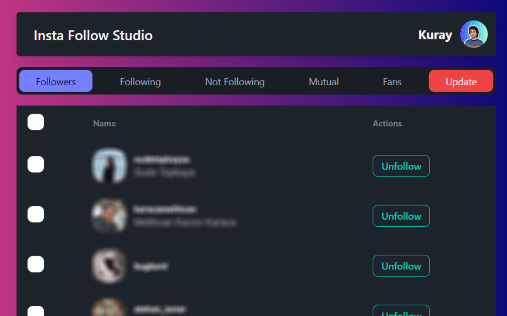

# InstaFollowStudio Chrome Extension (Discontinued)

This extension is unpublished from Chrome Web Store because of Copyright issue. So I decided to I Will share the code if i can't publish it on Chrome App Store. 

## Overview

InstaFollowStudio is a Chrome extension designed to help users track their Instagram followers and unfollowers easily. This extension provides a simple and efficient way to monitor changes in your Instagram followers list, allowing you to stay informed about who follows and unfollows you on the platform.

## Features

- **Follow/Unfollow Tracking:** InstaFollowStudio keeps a record of your Instagram followers and unfollowers, providing you with up-to-date information about changes in your follower count.

- **User-Friendly Interface:** InstaFollowStudio offers a user-friendly interface, making it easy for users to navigate and understand their follower analytics effortlessly.

- **Privacy-Focused:** Your Instagram account information is processed locally on your device, ensuring the privacy and security of your data. The extension does not store or share any sensitive information.

# Screenshots

## How to Use

1. **Download the Source Code:**
   - Visit our [GitHub repository](https://github.com/your-username/InstaFollowStudio) to access the source code.

### Chrome Extension Developer Mode

1. set your Chrome browser 'Developer mode' up
2. click 'Load unpacked', and select `instafollowstudio/build` folder

### Nomal FrontEnd Developer Mode

1. access `http://0.0.0.0:3000/`
2. when debugging popup page, open `http://0.0.0.0:3000//popup.html`
3. when debugging options page, open `http://0.0.0.0:3000//options.html`

2. **Install the Extension:**
   - After installation, click on the extension icon in the Chrome toolbar.
   - Follow the on-screen instructions to authorize the extension to access your Instagram account.

3. **Monitor Your Followers:**
   - Once authorized, the extension will start tracking your Instagram followers and unfollowers.

4. **View Analytics:**
   - Access the extension dashboard to view detailed analytics of your follower count changes over time.

## Support and Feedback

If you encounter any issues or have suggestions for improvements, please [submit an issue](https://github.com/kuraykaraaslan/InstaFollowStudio/issues) on our GitHub repository. We appreciate your feedback and will actively work to enhance the extension based on user input.

## Privacy Policy

Read our [Privacy Policy](https://kuray.dev/privacy) to understand how we handle your data and ensure your privacy.

## Contribution

If you are interested in contributing to the development of InstaFollowStudio, please [contact us](https://kuray.dev/contact) to discuss your ideas and suggestions.

# Technologies

- React
- Redux
- TypeScript
- Webpack
- Babel
- ESLint

# Special Thanks

- [guocaoy](https://github.com/guocaoyi)  for [create-chrome-ext](https://github.com/guocaoyi/create-chrome-ext)
- [Abir Taheer](https://github.com/abir-taheer) for [instagram-follower-following.js](https://gist.github.com/abir-taheer/0d3f1313def5eec6b78399c0fb69e4b1.js)

## License

This project is licensed under the [MIT License](https://opensource.org/licenses/MIT).

